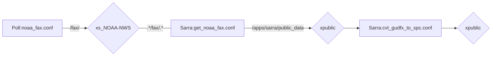

testng

```mermaid
graph LR
    A[Poll:noaa_fax.conf] -->|/fax/| Z{xs_NOAA-NWS}
    Z ---|.*/fax/.*| B[Sarra:get_noaa_fax.conf]
    B -->|/apps/sarra/public_data| C{xpublic}
    C --> D[Sarra:cvt_gudfx_to_spc.conf]
    D --> E{xpublic}
```
